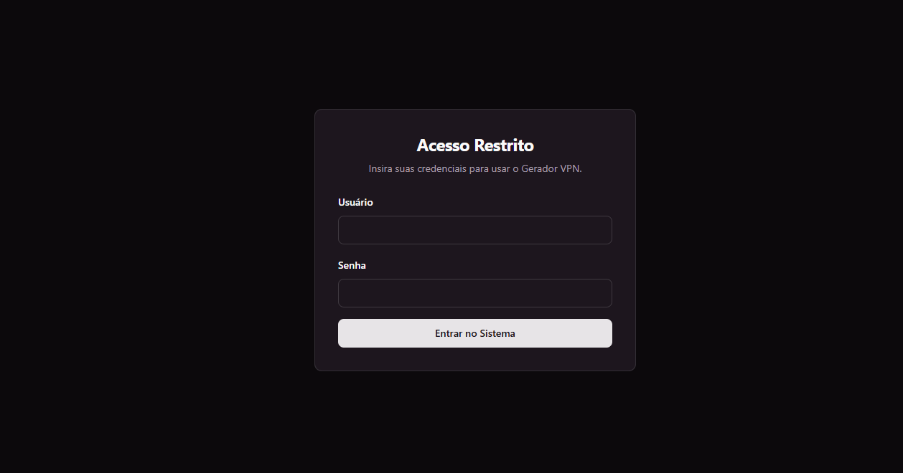
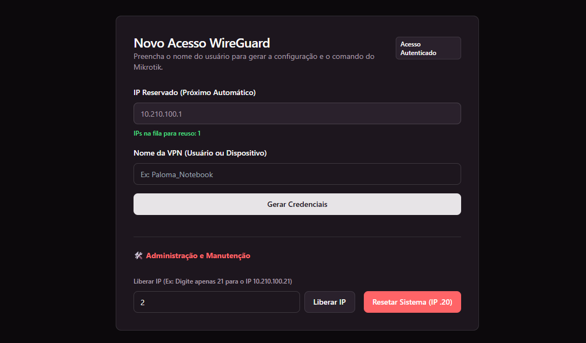

```markdown
# 🛡️ Gerador de VPN WireGuard (Integração Mikrotik)




Uma aplicação web leve e automatizada para gerenciar a criação e revogação de acessos VPN WireGuard. Desenvolvida em Python com Flask, a ferramenta foi projetada para rodar em um contêiner LXC (Proxmox) e entregar configurações prontas para serem aplicadas em roteadores Mikrotik e dispositivos de usuários finais.

## ✨ Funcionalidades
- **Gestão Inteligente de IPs:** Controle automático de IPs disponíveis (iniciando do `.20`), com sistema de fila para reaproveitamento de IPs liberados após o desligamento de colaboradores.
- **Automação de Chaves:** Geração nativa de chaves privadas e públicas utilizando a biblioteca oficial do WireGuard (`wg-tools`) em background.
- **Comandos Mikrotik Prontos:** Fornece o comando exato de terminal (RouterOS) para adicionar ou remover o *Peer*, incluindo comentários com o nome do usuário e o IP correto.
- **Arquivos `.conf` Automáticos:** Geração e download em um clique do arquivo de configuração do cliente, pronto para importação no aplicativo do WireGuard.
- **Padronização de Nomes:** Formatação automática para nomes em MAIÚSCULO, substituição de espaços por underline (`_`) e inserção do prefixo obrigatório `VPN-`.
- **Segurança Antiduplicidade:** Bloqueio ativo que impede a criação de novos perfis utilizando nomes de VPN já existentes no sistema.
- **Controle de Acesso:** Sistema de autenticação por usuário e senha com expiração de sessão automática após 1 hora de inatividade.
- **Interface Moderna:** UI inspirada no *shadcn/ui* construída com Tailwind CSS, incluindo suporte a *Dark Mode* com persistência no navegador, além de botões interativos de "Copiar com um clique".
- **Auto-Atualização (CI/CD Local):** Preparado para rotinas *cron*, permitindo que o servidor LXC baixe atualizações automaticamente do GitHub e reinicie o serviço.

## 🚀 Tecnologias Utilizadas
- **Backend:** Python 3, Flask, JSON (Armazenamento de Estado)
- **Frontend:** HTML5, CSS3, JavaScript, Tailwind CSS (via CDN)
- **Sistema & Infraestrutura:** Linux (Debian LXC), Systemd, Bash Script (Automação de pull)
- **Rede:** WireGuard Tools, Mikrotik RouterOS

## ⚙️ Como Instalar (Servidor LXC Debian/Ubuntu)

**1. Instale as dependências:**
```bash
apt update --allow-releaseinfo-change
apt install -y --fix-missing python3 python3-flask wireguard-tools git

```

**2. Clone o repositório:**

```bash
cd /opt
git clone [https://github.com/SEU_USUARIO/SEU_REPOSITORIO.git](https://github.com/SEU_USUARIO/SEU_REPOSITORIO.git) wg-generator

```

**3. Configure o serviço no Systemd:**
Crie o arquivo `/etc/systemd/system/wg-generator.service`:

```ini
[Unit]
Description=Gerador de Configuração WireGuard
After=network.target

[Service]
User=root
WorkingDirectory=/opt/wg-generator
ExecStart=/usr/bin/python3 /opt/wg-generator/app.py
Restart=always

[Install]
WantedBy=multi-user.target

```

Ative e inicie o serviço:

```bash
systemctl daemon-reload
systemctl enable --now wg-generator.service

```

## 📖 Como Utilizar

1. **Acesso:** Acesse o painel pelo navegador informando o IP do servidor LXC (ex: `http://10.210.10.230`).
2. **Login:** Utilize as credenciais padrão (configure no arquivo `app.py`).
3. **Criação de VPN:**
* Preencha o nome do usuário ou dispositivo (ex: `NOME_DO_USUARIO`).
* Clique em **Gerar Credenciais**.
* Na tela de sucesso, clique em **Copiar** no bloco 1 e cole no *New Terminal* do seu Mikrotik.
* Clique em **Baixar .conf** no bloco 2 e envie o arquivo para o usuário importar no aplicativo WireGuard.


4. **Desligamento/Liberação de IP:**
* Quando um colaborador for desligado, acesse o final da página.
* Digite o último octeto do IP do usuário (ex: se for `10.210.100.25`, digite apenas `25`).
* Clique em **Liberar IP no Gerador**.
* Copie o comando fornecido e cole no Mikrotik para remover o acesso. O IP retornará para a fila de reuso na próxima geração.